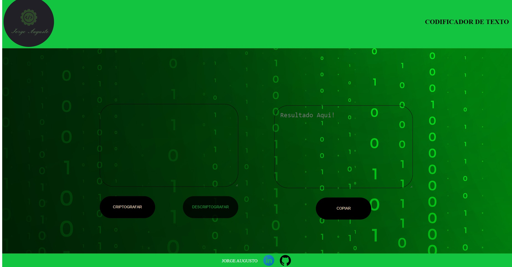

# Challenge-Alura: Decodificador de textos

   PROJETO PROPOSTO PELA ALURA EM PARCERIA COM A ORACLE, NO CURSO BÁSICO DE HTML, CSS E JS !

   CONSTRUIR UM DECODIFICADOR DE TEXTO COM VALIDAÇÃO DE ENTRADA(SOMENTE CARACTERES MINÚSCULOS), RESPONSIVIDADE E FUNÇÃO COPIAR TEXTO !
   
   

   ###### Técnicas aplicadas:

   - HTML semânticO.
   - CSS
   - JS
   - RESPONSIVIDADE
   - FIGMA
   - TRELLO

   ###### META:

   Jorge Augusto - [linkedin](https://www.linkedin.com/in/jorgeaugusto88/)
